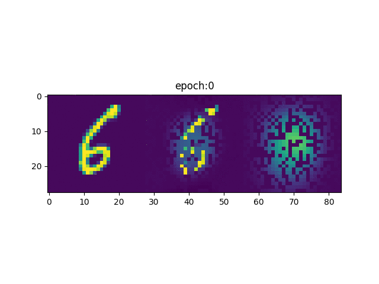
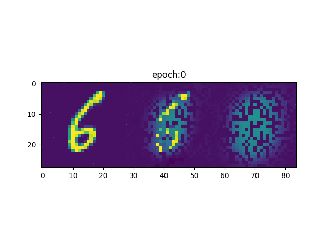

# Neural Process Family

This repository implements a pytorch version of Neural Process family:
- [Conditional Neural Processes](https://arxiv.org/abs/1807.01613) (CNP)

- [Neural Processes](https://arxiv.org/abs/1807.01622) (NP)

- [Attentive Neural Processes](https://arxiv.org/abs/1901.05761) (ANP)

- [Convolutional Conditional Neural Processes](https://arxiv.org/abs/1910.13556) (ConvCNP)

Most of the codes are inspired by the official implementations, except that I use uniform training settings and evaluation criteria. 
Contributions of the authors were deeply appreciated in the reference. Discussions with some of them really help me understand better of NP family.
 
The fitting processes(w.r.t epochs) of each model are presented as follows. For image datasets, we displayed unmasked images(left), predicted mean(middle) and variance(right).
 
| Model name          | EQ                                               | Periodic                                             | MNIST                                               | SVHN                                                | CelebA                                            |
| ------------------- |--------------------------------------------------| -----------------------------------------------------|-----------------------------------------------------|-----------------------------------------------------|---------------------------------------------------|
| NP                  |   |   |  | |    |
| CNP                 |  |  |  | | |
| ANP                 |  |  |  | | |
| ConvCNP             |  |  |

## Requirements
* Python 3.6+
* Pytorch 1.4
* matplotlib 3.1.2
* tqdm 4.36.1+
* numpy 0.17.1
* pandas 0.25.1
* tensorboard 1.14+ (optional if you do not want to visualize the training process) 
    
To install the requirements, run:

```bash
pip install -r requirements.txt
```


## Training

#### 1D datasets
To train the model(s) for 1D Gaussian Process sampled datasets, run *_train.py files. For example, in the folder `CNP` :

```train
python CNP_train.py
```
The following arguments can be modified in the first few lines of the __main__ functions 

- `TRAINING_ITERATIONS`: (default = 2e5), total number of generated batches during training 
- `MAX_CONTEXT_POINT`:  (default = 50), maximum number of samples for both context and target data 
- `VAL_AFTER`: (default = 1e3), validation frequency 
- `MODELNAME`: useful in NP_or_ANP_train.py, could be either ANP or NP 
- `kernel`: kernel functions to generate data
   - `EQ`: samples from a GP with an exponential quadratic (EQ) kernel: <br />    
      
      
   - `period`: samples from a GP with a periodic kernel: <br />  
 
In default, a tensorboard folder  `runs` will be created in order to save training and validation losses. 

Every 1,000 epochs, the model will be validated using new 64 tasks and the best model will be stored in `saved_model`.  

We also build a function to save the plots of model predictions on a fixed sample data and record the training progress as welll as baseline comparisons (as shown in the gif). 
     
#### 2D datasets      
To train the model(s) for image datasets, run *_train_2d.py files. For example:
```train
python CNP_train_2d.py
```           
The arguments are similar to 1d datasets, except `kernel = 'MNIST' / 'SVHN' / 'celebA'`.
In every `*_train_2d.py` and `_test_2d.py`, you are supposed to set your own image dataset path by changing `dataset = ImageReader(dataset = kernel, batch_size=64, datapath='/share/scratch/xuesongwang/metadata/')`.
We manually split the downloaded training datasets into training and validating sets with the proportion: 9:1(see `SubsetRandomSampler` in `Image_data_sampler`) and use additional testing sets. 

## Evaluation
#### 1D datasets
To evaluate models on 1D datasets, run *_test.py files. For example:

```eval
python CNP_test.py
```
The arguments are the same as in *_train.py. A model `kernel` + `MODELNAME.pt`
will be loaded from the folder `saved_model`. Each model will be tested on new 1024 tasks.


#### 2D datasets
To evaluate models on 2D datasets, run:
```eval
python CNP_test_2d.py
```
The arguments are the same as in *_train_2d.py.

## Results

We measure the log-likelihood on 1D and 2D datasets. Each model is tested for 10 runs and the results are 
 displayed in mean (std). 

| Model name          | EQ              | Periodic       | MNIST          | SVHN           | celebA         |
| ------------------- |---------------- | -------------- |--------------  |--------------  |--------------  |
| NP                  | 1.11 (1e-2)     |    0.18 (1e-2) | 1.66 (4e-2)    | 1.30 (4e-3)    | 0.91 (1e-2)
| CNP                 | 1.30 (2e-2)     |    0.47 (0)    | 2.22 (4e-2)    | 1.33 (4e-3)    | 0.90 (2e-2)    |
| ANP                 | 2.00 (2e-2)     |    1.03 (1e-2) | 2.34 (8e-2)    | 2.43 (2e-2)    | 1.55 (4e-2)
| ConvCNP             | 2.53 (3e-2)     |    1.43 (2e-2) |


## References
* Official implementations (tensorflow) of (A)NP and CNP:
https://github.com/deepmind/neural-processes

* Official implementation of ConvCNP on 1d datasets:
https://github.com/cambridge-mlg/convcnp
 . Our reproduction of NP and CNP is inspired by this repo, except that we use the same GPsampler and evaluation as in 
 the official NP repo
 
* Preprocessing 2d datasets, https://github.com/EmilienDupont/neural-processes  

* NP for sequential data, ANP-RNN： https://github.com/3springs/attentive-neural-processes

* Understanding Gaussian Process with visualizations: https://distill.pub/2019/visual-exploration-gaussian-processes/ 

* Understanding Neural Process with visualizations:   https://kasparmartens.rbind.io/post/np/