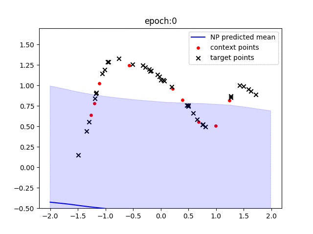
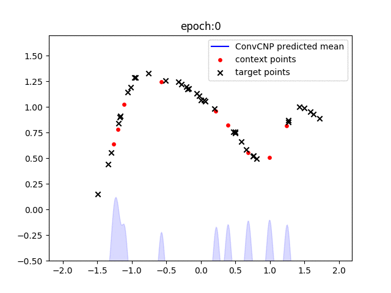

# Neural Process Families

This repository implements a pytorch version of Neural Process families:
- [Conditional Neural Processes](https://arxiv.org/abs/1807.01613) (CNP)

- [Neural Processes](https://arxiv.org/abs/1807.01622) (NP)

- [Attentive Neural Processes](https://arxiv.org/abs/1901.05761) (ANP)

- [Convolutional Conditional Neural Processes](https://arxiv.org/abs/1910.13556) (ConvCNP)

The fitting processes of each model are presented as below. An EQ-kernel and a periodic kerenl are used.
 
CNP:
<p align="center">
 
</p>
NP:
<p align="center">
 
</p>
ANP:
<p align="center">
 
</p>
ConvCNP:
<p align="center">
 
</p>

## Requirements
* Python 3.6+
* Pytorch 1.4
* matplotlib 3.1.2
* tqdm 4.36.1+
* numpy 0.17.1
* pandas 0.25.1
* tensorboard 1.14+ (optional if you do not want to visualize the training process) 
    
To install the requirements, run:

```bash
pip install -r requirements.txt
```


## Training

#### 1D datasets
To train the model(s) for 1D Gaussian Process sampled datasets, run *_train.py files. For example:

```train
python CNP_train.py
```
The following arguments can be modified in the first few lines of the __main__ functions 

- `TRAINING_ITERATIONS`: (default = 2e5), total number of generated batches during training 
- `MAX_CONTEXT_POINT`:  (default = 50), maximum number of samples for both context and target data 
- `VAL_AFTER`: (default = 1e3), validation frequency 
- `MODELNAME`: useful in NP_or_ANP_train.py, could be either ANP or NP 
- `kernel`: kernel functions to generate data
   - `EQ`: samples from a GP with an exponential quadratic (EQ) kernel: <br />    
      
      
   - `period`: samples from a GP with a periodic kernel: <br />  
 
In default, a tensorboard folder  `runs` will be created in order to save training and validation losses. 

Every 1,000 epochs, the model will be validated using new 64 tasks and the best model will be stored in `saved_model`.  

We also build a function to save the plots of model predictions on a fixed sample data and record the training progress as welll as baseline comparisons (as shown in the gif). 
     
#### 2D datasets      
To train the models for 2D datasets, run this command:
```train
python train_2d.py --dataset mnist --batch-size 16 --learning-rate 5e-4 --epochs 100
```           
The first argument, `dataset`(`default = mnist`), specifies the data that the model will be trained
on, and should be one of the following:
* `mnist`:This dataset can be downloaded using torchvision.datasets. Change the path `MNIST('./MNIST/mnist_data'...)`
of the function `load_dataset` in `data/image_data.py` to the location of your datasets;
* `svhn`: This dataset can also be downloaded using torchvision;
* `celebA`: This dataset can be downloaded from http://mmlab.ie.cuhk.edu.hk/projects/CelebA.html

We split the downloaded training datasets into training and validating sets with the proportion: 7:3 and use additional testing sets. 

## Evaluation
#### 1D datasets
To evaluate models on 1D datasets, run *_test.py files. For example:

```eval
python CNP_test.py
```
The arguments are the same as in *_train.py. A model `kernel` + `MODELNAME.pt`
will be loaded from the folder `saved_model`. Each model will be tested on new 1024 tasks.


#### 2D datasets
To evaluate models on 2D datasets, run:
```eval
python eval_2d.py --dataset mnist --batch-size 16
```
The argument is the same as in train_2d.py. A model called `dataset` + `_model.pth.gz`
will be loaded from the folder `saved_model`. The commented out function `plot_sample` gives a demo of model predictions.

## Results

We measure the log-likelihood on 1D and 2D datasets. Each model is tested for 10 runs and the results are 
 displayed in mean (std). 

| Model name          | EQ              | Periodic       | MNIST          | SVHN           | celebA         |
| ------------------- |---------------- | -------------- |--------------  |--------------  |--------------  |
| NP                  | 1.11 (1e-2)     |    0.18 (1e-2) |
| CNP                 | 1.30 (2e-2)     |    0.47 (0)    | 
| ANP                 | 2.00 (2e-2)     |    1.03 (1e-2) |
| ConvCNP             | 2.53 (3e-2)     |    1.43 (2e-2)  |


## References
* Official implementations (tensorflow) of (A)NP and CNP:
https://github.com/deepmind/neural-processes

* Official implementation of ConvCNP on 1d datasets:
https://github.com/cambridge-mlg/convcnp
 . Our reproduction of NP and CNP is inspired by this repo, except that we use the same GPsampler and evaluation as in 
 the official NP repo

* NP for sequential data, ANP-RNN： https://github.com/3springs/attentive-neural-processes

* Understanding Gaussian Process with visualizations: https://distill.pub/2019/visual-exploration-gaussian-processes/ 

Neural Process Papers I found useful:
